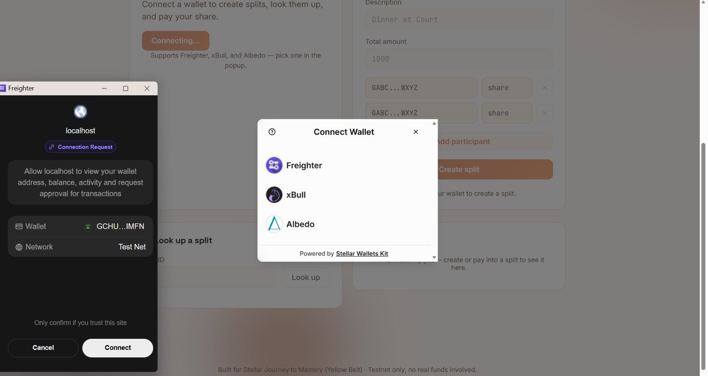
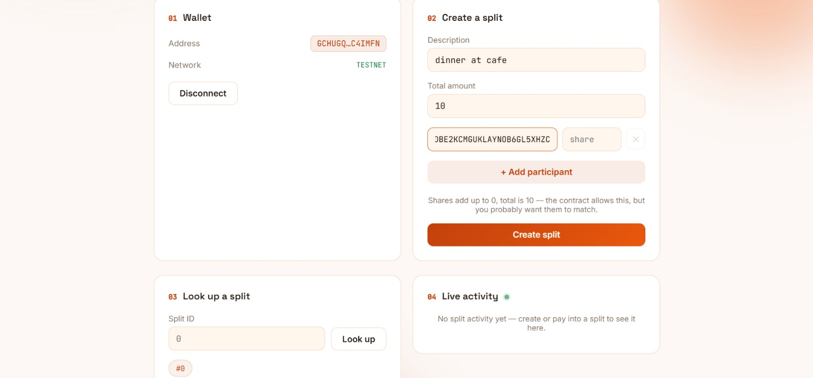
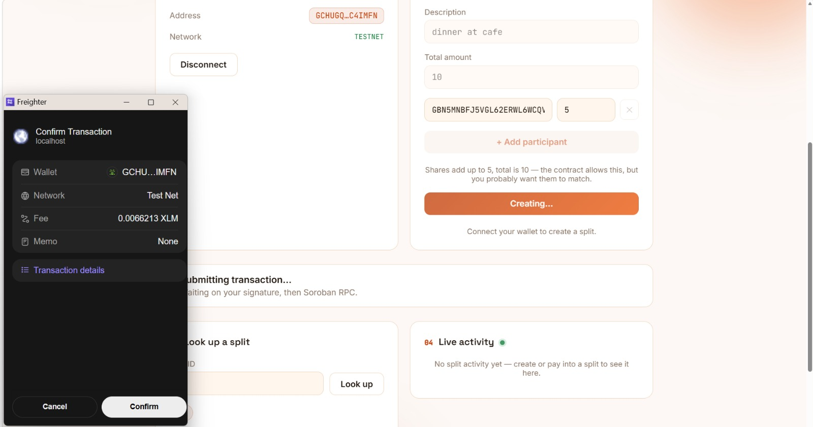
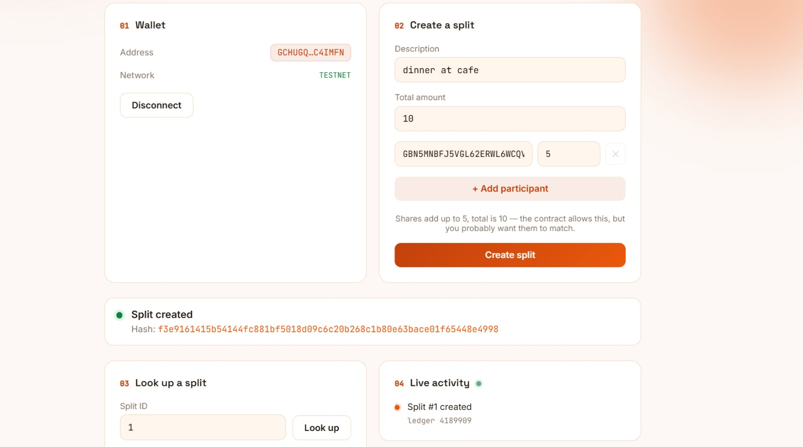

# SplitStellar — Yellow Belt Group Split Tracker

A group bill-splitting Soroban contract and frontend built for **Stellar Journey to Mastery — Yellow Belt (Level 2)** — the second building block of **SplitStellar**, a Stellar-native group-payments app I'm building through White, Yellow, and Orange Belt.

White Belt was "send one payment." This is "track who owes what in a *group*, on-chain, and watch it update in real time." A creator opens a split with a description, a total amount, and a list of participants with individual shares; each participant pays their own share into the same on-chain record; anyone can look the split up and see live progress — no spreadsheet, no group chat math, no backend keeping its own copy of the truth. The Soroban contract *is* the source of truth, and the frontend talks to it directly over Soroban RPC.

This is different from a generic single-payment tracker (like White Belt, or most testnet faucet demos) in three ways:

1. **Group state, not a single transfer.** The contract models a `Split` with parallel `participants` / `shares` / `paid` vectors and enforces per-participant logic (can't pay more than your share, can't pay if you're not a participant) — state a plain XLM payment can't express.
2. **Multi-wallet, not one hardcoded signer.** Any participant can connect with whichever Stellar wallet they use — Freighter, xBull, or Albedo — and pay their own share independently.
3. **Real-time, not "refresh to check."** The frontend polls Soroban RPC's event stream for this contract's `split` events, so a `create_split` or `pay_share` call from *any* wallet shows up in every open tab within seconds, without a page reload.

## Features

- **Multi-wallet connect** via [`@creit.tech/stellar-wallets-kit`](https://github.com/Creit-Tech/Stellar-Wallets-Kit) — Freighter, xBull, and Albedo, picked from the kit's built-in wallet-select modal
- **Network guard** — refuses to proceed unless the connected wallet reports Stellar Testnet, checked through the kit's `getNetwork()`, which every supported wallet module implements identically (not a Freighter-only check)
- **Create a split** — description, total amount, and a dynamic list of participant address + share rows
- **Split lookup** — look up any split by ID, or jump to one from the "recent splits" chips (backed by the contract's `get_recent_splits`); shows a progress bar and each participant's paid/owed status
- **Pay your share** — if the connected wallet address is a participant in the looked-up split, a form appears to pay some or all of the remaining share
- **Live Activity feed** — polls Soroban RPC's `getEvents` for this contract's `("split", "created")` / `("split", "paid")` topic events every 6 seconds and appends new activity to a list, with links to Stellar Expert — no manual refresh needed
- **Transaction feedback** — pending / success / error states for both create and pay flows, with the tx hash linked to [stellar.expert](https://stellar.expert/explorer/testnet)
- Contract-side input validation (mismatched participants/shares, non-participant payer, overpaid share, empty participant list) surfaced as readable error messages, not raw XDR

## Tech stack

- **Contract**: [Soroban](https://developers.stellar.org/docs/build/smart-contracts) / Rust, built with the Stellar CLI, deployed to Stellar Testnet
- **Frontend**: React + TypeScript + [Vite](https://vitejs.dev)
- [`@creit.tech/stellar-wallets-kit`](https://www.npmjs.com/package/@creit.tech/stellar-wallets-kit) — multi-wallet connect, network detection, transaction signing
- [`@stellar/stellar-sdk`](https://www.npmjs.com/package/@stellar/stellar-sdk) — building/simulating/submitting contract calls and polling events, straight from the browser to Soroban RPC
- **No backend** — the frontend calls `https://soroban-testnet.stellar.org` directly; there is no server component and no database. The Soroban ledger is the only source of truth.

## Project structure

```
contract/
  split_tracker/
    src/lib.rs                 # SplitTracker contract: create_split, pay_share,
                                #   get_split, get_recent_splits
    src/test.rs                # Contract unit tests

frontend/
  src/lib/
    wallet.ts                  # Wallets-kit setup, connect/disconnect, network guard, signing
    contract.ts                # Soroban RPC calls: createSplit, payShare, getSplit, getRecentSplits
    events.ts                  # getEvents polling for split created/paid activity
  src/components/
    WalletPanel.tsx             # Wallet connect/disconnect UI
    CreateSplitForm.tsx         # Description/total/participant+share rows
    SplitLookup.tsx             # Split-by-ID search, recent-splits chips, progress bar
    PayShareForm.tsx            # Pay-remaining-share form (shown when you're a participant)
    LiveActivity.tsx            # Polling live-events feed
    TxFeedback.tsx              # Pending/success/error transaction feedback
  src/App.tsx                   # Wires state + components together
  src/App.css                   # Design tokens & styling
```

## Deployed contract

- **Contract ID (Testnet):** [`CAF7HV6V6J7FUYHTGX5RIZIYGE4SXMZEDQOF4432AIN7256O45573IJ3`](https://lab.stellar.org/r/testnet/contract/CAF7HV6V6J7FUYHTGX5RIZIYGE4SXMZEDQOF4432AIN7256O45573IJ3)
- **Example transaction** (a `create_split` invocation): [`73025fefd408af6e7d7c0c2cfc513abd76f13b398694055d2f0b2b388f9e288c`](https://stellar.expert/explorer/testnet/tx/73025fefd408af6e7d7c0c2cfc513abd76f13b398694055d2f0b2b388f9e288c)

## Setup instructions

### Contract (for reference — it's already built and deployed at the address above)

```bash
cd contract
cargo test                                      # run contract unit tests
rustup target add wasm32v1-none                 # once, if not already installed
stellar contract build --optimize
stellar keys generate deployer --network testnet --fund
stellar contract deploy \
  --wasm target/wasm32v1-none/release/split_tracker.wasm \
  --source deployer \
  --network testnet
```

### Frontend

**Prerequisites**

- [Node.js](https://nodejs.org) 18+
- At least one of: [Freighter](https://www.freighter.app/), [xBull](https://xbull.app/), or [Albedo](https://albedo.link/) — set to **Testnet** (Freighter/xBull have a network setting in the extension; Albedo asks per-session)
- A wallet account funded with testnet XLM (fund via [Friendbot](https://friendbot.stellar.org/?addr=YOUR_PUBLIC_KEY) if needed)

**Install & run**

```bash
cd frontend
npm install
npm run dev
```

Open the printed local URL (typically `http://localhost:5173`) in a browser with your wallet extension installed.

**Build for production**

```bash
cd frontend
npm run build
npm run preview
```

## How to test the full flow

1. Click **Connect Wallet**, pick a wallet in the popup (Freighter, xBull, or Albedo), and approve the connection.
2. In **Create a split**, enter a description, a total amount, and at least one participant address + share (add more rows with "+ Add participant"). Click **Create split** and approve the signature request.
3. The new split's ID auto-loads in the **Look up a split** panel — check the progress bar and per-participant paid/owed rows.
4. Watch the **Live activity** panel: the `create_split` event should appear there within a few seconds, without refreshing the page.
5. If your connected wallet address is one of the split's participants, a **Pay share** form appears. Enter an amount and submit — approve the signature, then watch both the split's progress bar and the Live Activity feed update.
6. Click **Disconnect** to clear the session.

## Live demo

https://stellar-yellow-belt-dr5z2mopz-hermit210s-projects.vercel.app/

## Screenshots

### Wallet options available (multi-wallet selector)
The wallets-kit auth modal listing Freighter / xBull / Albedo, with a live Freighter connection-request popup open alongside it.



### Wallet connected, ready to create a split
The wallet panel showing a connected testnet address, next to the Create a split form.



### Confirming a transaction in the wallet
Freighter's Confirm Transaction popup during a `create_split` call, with the app mid-submission behind it.



### Split created, with live activity update
The success state after `create_split`, showing the returned transaction hash and the new split appearing in the Live Activity feed without a page reload.



## Requirements checklist

**1. Public GitHub repository**
✅ https://github.com/Hermit210/stellar-yellow-belt

**2. README completeness**
✅ Project description, setup instructions, contract address, example tx hash, screenshot slots, requirements checklist (this file)

**3. Git history**
✅ 10+ meaningful, atomic commits (`git log --oneline | wc -l`) — contract+frontend, multi-wallet, real-time events, test coverage, error handling, docs, each as their own commit

**4. Multi-wallet integration**
✅ Freighter, xBull, and Albedo via `@creit.tech/stellar-wallets-kit`, with a uniform testnet network guard across all three (verified against the kit's `ModuleInterface` — every module implements `getNetwork()` identically, not just Freighter)

**5. Smart contract deployed + verifiable transaction hash**
✅ `CAF7HV6V6J7FUYHTGX5RIZIYGE4SXMZEDQOF4432AIN7256O45573IJ3` on Testnet — [example tx](https://stellar.expert/explorer/testnet/tx/73025fefd408af6e7d7c0c2cfc513abd76f13b398694055d2f0b2b388f9e288c), independently verified against Horizon (`successful: true`, ledger 4187315)

**6. Real-time event synchronization**
✅ `src/lib/events.ts` polls Soroban RPC `getEvents` for this contract's split topics every 6s, cursor-paginated so only new events are appended; `LiveActivity.tsx` cleans up its polling timer on unmount

**7. Screenshots**
✅ Real image files committed under `docs/screenshots/` and embedded above (not just external links) — see [Screenshots](#screenshots)

**8. Live demo link**
✅ See [Live demo](#live-demo) — note: if the linked Vercel deployment prompts for Vercel SSO instead of loading the app, it's a preview deployment with Deployment Protection on; promote it to a public Production deployment (Vercel dashboard → Project → Settings → Deployment Protection) and update the link above

## Notes

- This app only ever targets **Stellar Testnet** — every wallet module's network is checked before connecting and again before signing.
- No private keys ever touch this app's code; all signing happens inside the connected wallet extension.
- There is intentionally no backend: every read (split lookup, recent splits, live events) and every write (create split, pay share) goes straight from the browser to `https://soroban-testnet.stellar.org`.
- Part of my Stellar Journey to Mastery build track — [White Belt](https://github.com/Hermit210/stellar-white-belt-) was the single-payment primitive this contract builds on; next up is Orange Belt.
